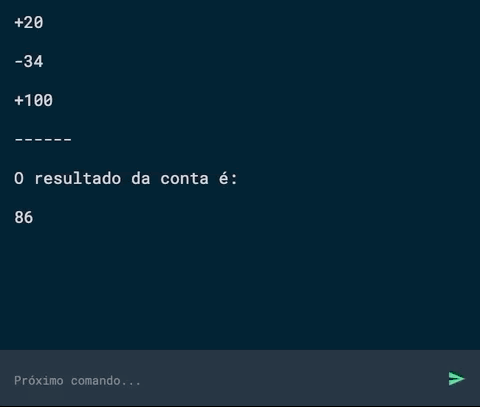

# Calculando #
Uma calculadora simples que conseque calcular números positivos ou negativos

## Critério de aceite ##
* Enviar comandos clicando no botão Enviar
* Quando um comando for enviado, adicionar ele na tela
* Sempre que um comando for enviado, apagar o input
* Sempre que um comando for enviado, mover o scroll para o final da tela
* Enviar comandos apertando o ENTER
* Se for enviado um comando em branco mostrar o erro `Insira um número` 
* Sempre que um erro for mostrado, ele deve ficar visível por 2 segundos e depois desaparecer lentamente
* Se não for enviado um número mostrar o erro `Não é um número` 
* Se for enviado um número sem nenhum sinal, adicionar antes o sinal `+`
* Se for enviado o comando `=` resolver a conta com todos os números presentes na tela

## Links de ajuda ##
* [Favicon generator](https://www.favicon-generator.org/)
* [Material design icons](https://materialdesignicons.com/)
* [Roboto Mono](https://fonts.google.com/specimen/Roboto+Mono?selection.family=Roboto+Mono)
* [Gulp](https://browsersync.io/docs/gulp)
* [Vanilla JS](http://vanilla-js.com/)
* [You dont need jquery](https://blog.garstasio.com/you-dont-need-jquery/selectors/)
